# Projects and dependencies analysis

This document provides a comprehensive overview of the projects and their dependencies in the context of upgrading to .NETCoreApp,Version=v10.0.

## Table of Contents

- [Executive Summary](#executive-Summary)
  - [Highlevel Metrics](#highlevel-metrics)
  - [Projects Compatibility](#projects-compatibility)
  - [Package Compatibility](#package-compatibility)
  - [API Compatibility](#api-compatibility)
- [Aggregate NuGet packages details](#aggregate-nuget-packages-details)
- [Top API Migration Challenges](#top-api-migration-challenges)
  - [Technologies and Features](#technologies-and-features)
  - [Most Frequent API Issues](#most-frequent-api-issues)
- [Projects Relationship Graph](#projects-relationship-graph)
- [Project Details](#project-details)

  - [Eto.Forms\x8086NetEmuEto.Gtk\x8086NetEmuEto.Gtk.csproj](#etoformsx8086netemuetogtkx8086netemuetogtkcsproj)
  - [Eto.Forms\x8086NetEmuEto.Mac\x8086NetEmuEto.Mac.csproj](#etoformsx8086netemuetomacx8086netemuetomaccsproj)
  - [Eto.Forms\x8086NetEmuEto.Wpf\x8086NetEmuEto.Wpf.csproj](#etoformsx8086netemuetowpfx8086netemuetowpfcsproj)
  - [Eto.Forms\x8086NetEmuEto\x8086NetEmuEto.csproj](#etoformsx8086netemuetox8086netemuetocsproj)
  - [GenOpCodes\GenOpCodes.vbproj](#genopcodesgenopcodesvbproj)
  - [RunTests\RunTests.vbproj](#runtestsruntestsvbproj)
  - [RunTests2\RunTests2.csproj](#runtests2runtests2csproj)
  - [x8086NetEmu\x8086NetEmu.vbproj](#x8086netemux8086netemuvbproj)
  - [x8086NetEmuConsole\x8086NetEmuConsole.vbproj](#x8086netemuconsolex8086netemuconsolevbproj)
  - [x8086NetEmuRenderers\x8086NetEmuRenderers.vbproj](#x8086netemurenderersx8086netemurenderersvbproj)
  - [x8086NetEmuWinForms\x8086NetEmuWinForms.vbproj](#x8086netemuwinformsx8086netemuwinformsvbproj)

## Executive Summary

### Highlevel Metrics

| Metric | Count | Status |
| :--- | :---: | :--- |
| Total Projects | 11 | 7 require upgrade |
| Total NuGet Packages | 8 | All compatible |
| Total Code Files | 120 |  |
| Total Code Files with Incidents | 42 |  |
| Total Lines of Code | 27345 |  |
| Total Number of Issues | 6600 |  |
| Estimated LOC to modify | 6587+ | at least 24.1% of codebase |

### Projects Compatibility

| Project | Target Framework | Difficulty | Package Issues | API Issues | Est. LOC Impact | Description |
| :--- | :---: | :---: | :---: | :---: | :---: | :--- |
| [Eto.Forms\x8086NetEmuEto.Gtk\x8086NetEmuEto.Gtk.csproj](#etoformsx8086netemuetogtkx8086netemuetogtkcsproj) | net10.0 | ✅ None | 0 | 0 |  | WinForms, Sdk Style = True |
| [Eto.Forms\x8086NetEmuEto.Mac\x8086NetEmuEto.Mac.csproj](#etoformsx8086netemuetomacx8086netemuetomaccsproj) | net10.0 | ✅ None | 0 | 0 |  | DotNetCoreApp, Sdk Style = True |
| [Eto.Forms\x8086NetEmuEto.Wpf\x8086NetEmuEto.Wpf.csproj](#etoformsx8086netemuetowpfx8086netemuetowpfcsproj) | net10.0-windows7.0 | ✅ None | 0 | 0 |  | WinForms, Sdk Style = True |
| [Eto.Forms\x8086NetEmuEto\x8086NetEmuEto.csproj](#etoformsx8086netemuetox8086netemuetocsproj) | net10.0 | ✅ None | 0 | 0 |  | ClassLibrary, Sdk Style = True |
| [GenOpCodes\GenOpCodes.vbproj](#genopcodesgenopcodesvbproj) | net481 | 🟢 Low | 0 | 0 |  | ClassicDotNetApp, Sdk Style = False |
| [RunTests\RunTests.vbproj](#runtestsruntestsvbproj) | net481 | 🟢 Low | 0 | 3 | 3+ | ClassicDotNetApp, Sdk Style = False |
| [RunTests2\RunTests2.csproj](#runtests2runtests2csproj) | net481 | 🟢 Low | 0 | 0 |  | DotNetCoreApp, Sdk Style = True |
| [x8086NetEmu\x8086NetEmu.vbproj](#x8086netemux8086netemuvbproj) | net481 | 🟢 Low | 0 | 15 | 15+ | ClassicClassLibrary, Sdk Style = False |
| [x8086NetEmuConsole\x8086NetEmuConsole.vbproj](#x8086netemuconsolex8086netemuconsolevbproj) | net481 | 🟢 Low | 0 | 0 |  | ClassicDotNetApp, Sdk Style = False |
| [x8086NetEmuRenderers\x8086NetEmuRenderers.vbproj](#x8086netemurenderersx8086netemurenderersvbproj) | net481 | 🟡 Medium | 0 | 809 | 809+ | ClassicWinForms, Sdk Style = False |
| [x8086NetEmuWinForms\x8086NetEmuWinForms.vbproj](#x8086netemuwinformsx8086netemuwinformsvbproj) | net481 | 🟡 Medium | 0 | 5760 | 5760+ | ClassicWinForms, Sdk Style = False |

### Package Compatibility

| Status | Count | Percentage |
| :--- | :---: | :---: |
| ✅ Compatible | 8 | 100.0% |
| ⚠️ Incompatible | 0 | 0.0% |
| 🔄 Upgrade Recommended | 0 | 0.0% |
| ***Total NuGet Packages*** | ***8*** | ***100%*** |

### API Compatibility

| Category | Count | Impact |
| :--- | :---: | :--- |
| 🔴 Binary Incompatible | 5789 | High - Require code changes |
| 🟡 Source Incompatible | 792 | Medium - Needs re-compilation and potential conflicting API error fixing |
| 🔵 Behavioral change | 6 | Low - Behavioral changes that may require testing at runtime |
| ✅ Compatible | 18664 |  |
| ***Total APIs Analyzed*** | ***25251*** |  |

## Aggregate NuGet packages details

| Package | Current Version | Suggested Version | Projects | Description |
| :--- | :---: | :---: | :--- | :--- |
| Eto.Forms | 2.11.0 |  | [x8086NetEmuEto.csproj](#etoformsx8086netemuetox8086netemuetocsproj) | ✅Compatible |
| Eto.Platform.Gtk | 2.11.0 |  | [x8086NetEmuEto.Gtk.csproj](#etoformsx8086netemuetogtkx8086netemuetogtkcsproj) | ✅Compatible |
| Eto.Platform.Mac64 | 2.11.0 |  | [x8086NetEmuEto.Mac.csproj](#etoformsx8086netemuetomacx8086netemuetomaccsproj) | ✅Compatible |
| Eto.Platform.Wpf | 2.11.0 |  | [x8086NetEmuEto.Wpf.csproj](#etoformsx8086netemuetowpfx8086netemuetowpfcsproj) | ✅Compatible |
| Eto.Serialization.Json | 2.11.0 |  | [x8086NetEmuEto.csproj](#etoformsx8086netemuetox8086netemuetocsproj) | ✅Compatible |
| ManagedBass | 4.0.2 |  | [x8086NetEmu.vbproj](#x8086netemux8086netemuvbproj) | ✅Compatible |
| Newtonsoft.Json | 13.0.4 |  | [RunTests2.csproj](#runtests2runtests2csproj) | ✅Compatible |
| System.Management | 10.0.5 |  | [x8086NetEmuEto.csproj](#etoformsx8086netemuetox8086netemuetocsproj) | ✅Compatible |

## Top API Migration Challenges

### Technologies and Features

| Technology | Issues | Percentage | Migration Path |
| :--- | :---: | :---: | :--- |
| Windows Forms | 5744 | 87.2% | Windows Forms APIs for building Windows desktop applications with traditional Forms-based UI that are available in .NET on Windows. Enable Windows Desktop support: Option 1 (Recommended): Target net9.0-windows; Option 2: Add <UseWindowsDesktop>true</UseWindowsDesktop>; Option 3 (Legacy): Use Microsoft.NET.Sdk.WindowsDesktop SDK. |
| GDI+ / System.Drawing | 787 | 11.9% | System.Drawing APIs for 2D graphics, imaging, and printing that are available via NuGet package System.Drawing.Common. Note: Not recommended for server scenarios due to Windows dependencies; consider cross-platform alternatives like SkiaSharp or ImageSharp for new code. |
| System Management (WMI) | 3 | 0.0% | Windows Management Instrumentation (WMI) APIs for system administration and monitoring that are available via NuGet package System.Management. These APIs provide access to Windows system information but are Windows-only; consider cross-platform alternatives for new code. |
| Legacy Configuration System | 1 | 0.0% | Legacy XML-based configuration system (app.config/web.config) that has been replaced by a more flexible configuration model in .NET Core. The old system was rigid and XML-based. Migrate to Microsoft.Extensions.Configuration with JSON/environment variables; use System.Configuration.ConfigurationManager NuGet package as interim bridge if needed. |
| Code Access Security (CAS) | 1 | 0.0% | Code Access Security (CAS) APIs that were removed in .NET Core/.NET for security and performance reasons. CAS provided fine-grained security policies but proved complex and ineffective. Remove CAS usage; not supported in modern .NET. |
| Windows Forms Legacy Controls | 1 | 0.0% | Legacy Windows Forms controls that have been removed from .NET Core/5+ including StatusBar, DataGrid, ContextMenu, MainMenu, MenuItem, and ToolBar. These controls were replaced by more modern alternatives. Use ToolStrip, MenuStrip, ContextMenuStrip, and DataGridView instead. |

### Most Frequent API Issues

| API | Count | Percentage | Category |
| :--- | :---: | :---: | :--- |
| T:System.Windows.Forms.TextBox | 401 | 6.1% | Binary Incompatible |
| T:System.Windows.Forms.Label | 300 | 4.6% | Binary Incompatible |
| T:System.Windows.Forms.ToolStripMenuItem | 294 | 4.5% | Binary Incompatible |
| T:System.Windows.Forms.CheckBox | 215 | 3.3% | Binary Incompatible |
| T:System.Windows.Forms.AnchorStyles | 172 | 2.6% | Binary Incompatible |
| T:System.Windows.Forms.Button | 159 | 2.4% | Binary Incompatible |
| T:System.Windows.Forms.ListView | 126 | 1.9% | Binary Incompatible |
| T:System.Drawing.Font | 119 | 1.8% | Source Incompatible |
| P:System.Windows.Forms.Control.Name | 119 | 1.8% | Binary Incompatible |
| P:System.Windows.Forms.Control.Size | 100 | 1.5% | Binary Incompatible |
| T:System.Windows.Forms.Control.ControlCollection | 97 | 1.5% | Binary Incompatible |
| P:System.Windows.Forms.Control.Controls | 97 | 1.5% | Binary Incompatible |
| P:System.Windows.Forms.Control.Location | 95 | 1.4% | Binary Incompatible |
| M:System.Windows.Forms.Control.ControlCollection.Add(System.Windows.Forms.Control) | 94 | 1.4% | Binary Incompatible |
| P:System.Windows.Forms.Control.TabIndex | 93 | 1.4% | Binary Incompatible |
| T:System.Drawing.GraphicsUnit | 90 | 1.4% | Source Incompatible |
| T:System.Windows.Forms.Control | 90 | 1.4% | Binary Incompatible |
| T:System.Drawing.FontStyle | 86 | 1.3% | Source Incompatible |
| T:System.Windows.Forms.GroupBox | 83 | 1.3% | Binary Incompatible |
| T:System.Windows.Forms.FlatStyle | 81 | 1.2% | Binary Incompatible |
| T:System.Windows.Forms.ColumnHeader | 73 | 1.1% | Binary Incompatible |
| T:System.Windows.Forms.HorizontalAlignment | 69 | 1.0% | Binary Incompatible |
| P:System.Windows.Forms.TextBox.Text | 68 | 1.0% | Binary Incompatible |
| T:System.Windows.Forms.ControlStyles | 60 | 0.9% | Binary Incompatible |
| P:System.Windows.Forms.ToolStripItem.Text | 49 | 0.7% | Binary Incompatible |
| T:System.Windows.Forms.ListViewItem.ListViewSubItem | 48 | 0.7% | Binary Incompatible |
| T:System.Drawing.Bitmap | 47 | 0.7% | Source Incompatible |
| T:System.Windows.Forms.Keys | 45 | 0.7% | Binary Incompatible |
| F:System.Drawing.FontStyle.Regular | 43 | 0.7% | Source Incompatible |
| P:System.Windows.Forms.ToolStripItem.Size | 43 | 0.7% | Binary Incompatible |
| P:System.Windows.Forms.ToolStripItem.Name | 43 | 0.7% | Binary Incompatible |
| T:System.Windows.Forms.ToolStripSeparator | 42 | 0.6% | Binary Incompatible |
| T:System.Windows.Forms.FlatButtonAppearance | 42 | 0.6% | Binary Incompatible |
| P:System.Windows.Forms.ButtonBase.FlatAppearance | 42 | 0.6% | Binary Incompatible |
| T:System.Windows.Forms.ListViewItem.ListViewSubItemCollection | 41 | 0.6% | Binary Incompatible |
| P:System.Windows.Forms.ListViewItem.SubItems | 41 | 0.6% | Binary Incompatible |
| T:System.Drawing.StringFormatFlags | 36 | 0.5% | Source Incompatible |
| M:System.Windows.Forms.ToolStripMenuItem.#ctor | 36 | 0.5% | Binary Incompatible |
| T:System.Drawing.Graphics | 35 | 0.5% | Source Incompatible |
| P:System.Windows.Forms.Label.Text | 35 | 0.5% | Binary Incompatible |
| T:System.Windows.Forms.MouseButtons | 33 | 0.5% | Binary Incompatible |
| T:System.Windows.Forms.RichTextBox | 32 | 0.5% | Binary Incompatible |
| F:System.Drawing.GraphicsUnit.Point | 31 | 0.5% | Source Incompatible |
| M:System.Drawing.Font.#ctor(System.String,System.Single,System.Drawing.FontStyle,System.Drawing.GraphicsUnit,System.Byte) | 31 | 0.5% | Source Incompatible |
| P:System.Windows.Forms.Control.Font | 31 | 0.5% | Binary Incompatible |
| M:System.Windows.Forms.Control.SetStyle(System.Windows.Forms.ControlStyles,System.Boolean) | 30 | 0.5% | Binary Incompatible |
| P:System.Windows.Forms.TextBoxBase.BackColor | 30 | 0.5% | Binary Incompatible |
| P:System.Windows.Forms.Control.Anchor | 28 | 0.4% | Binary Incompatible |
| M:System.Windows.Forms.Label.#ctor | 27 | 0.4% | Binary Incompatible |
| T:System.Windows.Forms.ListViewItem | 27 | 0.4% | Binary Incompatible |

## Projects Relationship Graph

Legend:
📦 SDK-style project
⚙️ Classic project

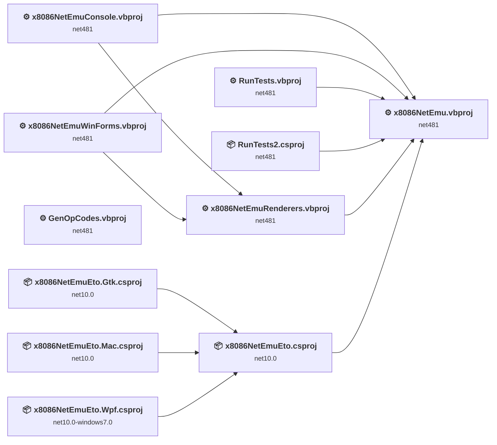

## Project Details

### Eto.Forms\x8086NetEmuEto.Gtk\x8086NetEmuEto.Gtk.csproj

#### Project Info

- **Current Target Framework:** net10.0✅
- **SDK-style**: True
- **Project Kind:** WinForms
- **Dependencies**: 1
- **Dependants**: 0
- **Number of Files**: 1
- **Lines of Code**: 11
- **Estimated LOC to modify**: 0+ (at least 0.0% of the project)

#### Dependency Graph

Legend:
📦 SDK-style project
⚙️ Classic project

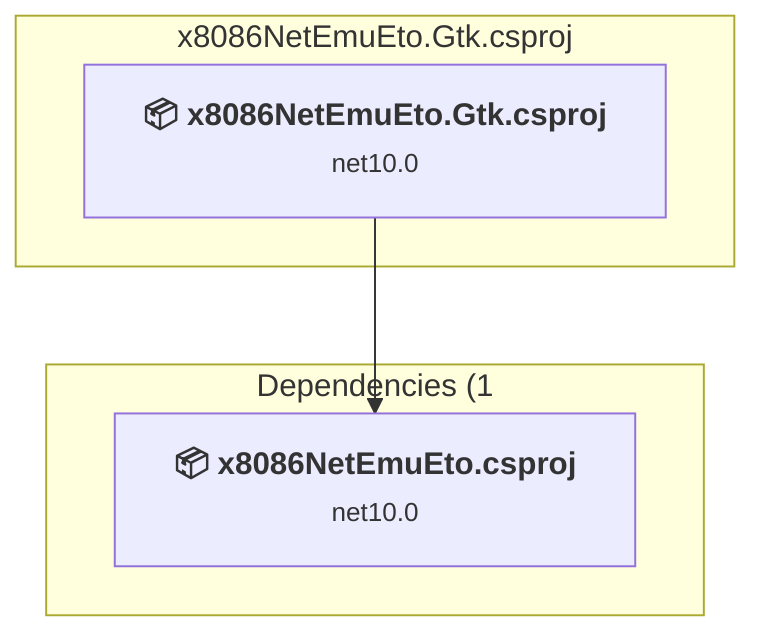

### API Compatibility

| Category | Count | Impact |
| :--- | :---: | :--- |
| 🔴 Binary Incompatible | 0 | High - Require code changes |
| 🟡 Source Incompatible | 0 | Medium - Needs re-compilation and potential conflicting API error fixing |
| 🔵 Behavioral change | 0 | Low - Behavioral changes that may require testing at runtime |
| ✅ Compatible | 0 |  |
| ***Total APIs Analyzed*** | ***0*** |  |

### Eto.Forms\x8086NetEmuEto.Mac\x8086NetEmuEto.Mac.csproj

#### Project Info

- **Current Target Framework:** net10.0✅
- **SDK-style**: True
- **Project Kind:** DotNetCoreApp
- **Dependencies**: 1
- **Dependants**: 0
- **Number of Files**: 1
- **Lines of Code**: 11
- **Estimated LOC to modify**: 0+ (at least 0.0% of the project)

#### Dependency Graph

Legend:
📦 SDK-style project
⚙️ Classic project

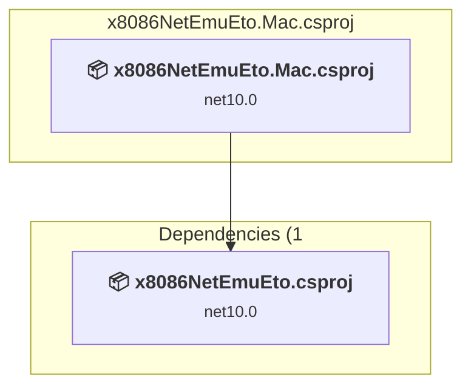

### API Compatibility

| Category | Count | Impact |
| :--- | :---: | :--- |
| 🔴 Binary Incompatible | 0 | High - Require code changes |
| 🟡 Source Incompatible | 0 | Medium - Needs re-compilation and potential conflicting API error fixing |
| 🔵 Behavioral change | 0 | Low - Behavioral changes that may require testing at runtime |
| ✅ Compatible | 0 |  |
| ***Total APIs Analyzed*** | ***0*** |  |

### Eto.Forms\x8086NetEmuEto.Wpf\x8086NetEmuEto.Wpf.csproj

#### Project Info

- **Current Target Framework:** net10.0-windows7.0✅
- **SDK-style**: True
- **Project Kind:** WinForms
- **Dependencies**: 1
- **Dependants**: 0
- **Number of Files**: 1
- **Lines of Code**: 11
- **Estimated LOC to modify**: 0+ (at least 0.0% of the project)

#### Dependency Graph

Legend:
📦 SDK-style project
⚙️ Classic project

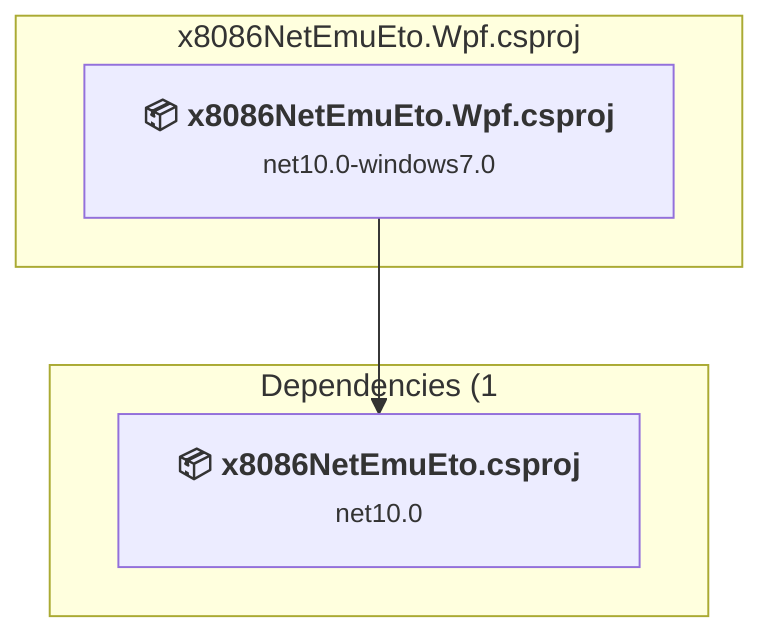

### API Compatibility

| Category | Count | Impact |
| :--- | :---: | :--- |
| 🔴 Binary Incompatible | 0 | High - Require code changes |
| 🟡 Source Incompatible | 0 | Medium - Needs re-compilation and potential conflicting API error fixing |
| 🔵 Behavioral change | 0 | Low - Behavioral changes that may require testing at runtime |
| ✅ Compatible | 0 |  |
| ***Total APIs Analyzed*** | ***0*** |  |

### Eto.Forms\x8086NetEmuEto\x8086NetEmuEto.csproj

#### Project Info

- **Current Target Framework:** net10.0✅
- **SDK-style**: True
- **Project Kind:** ClassLibrary
- **Dependencies**: 1
- **Dependants**: 3
- **Number of Files**: 6
- **Lines of Code**: 731
- **Estimated LOC to modify**: 0+ (at least 0.0% of the project)

#### Dependency Graph

Legend:
📦 SDK-style project
⚙️ Classic project

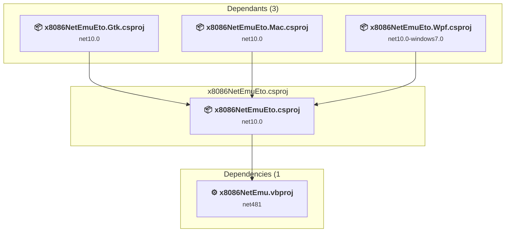

### API Compatibility

| Category | Count | Impact |
| :--- | :---: | :--- |
| 🔴 Binary Incompatible | 0 | High - Require code changes |
| 🟡 Source Incompatible | 0 | Medium - Needs re-compilation and potential conflicting API error fixing |
| 🔵 Behavioral change | 0 | Low - Behavioral changes that may require testing at runtime |
| ✅ Compatible | 0 |  |
| ***Total APIs Analyzed*** | ***0*** |  |

### GenOpCodes\GenOpCodes.vbproj

#### Project Info

- **Current Target Framework:** net481
- **Proposed Target Framework:** net10.0
- **SDK-style**: False
- **Project Kind:** ClassicDotNetApp
- **Dependencies**: 0
- **Dependants**: 0
- **Number of Files**: 6
- **Number of Files with Incidents**: 1
- **Lines of Code**: 374
- **Estimated LOC to modify**: 0+ (at least 0.0% of the project)

#### Dependency Graph

Legend:
📦 SDK-style project
⚙️ Classic project

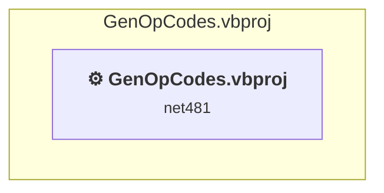

### API Compatibility

| Category | Count | Impact |
| :--- | :---: | :--- |
| 🔴 Binary Incompatible | 0 | High - Require code changes |
| 🟡 Source Incompatible | 0 | Medium - Needs re-compilation and potential conflicting API error fixing |
| 🔵 Behavioral change | 0 | Low - Behavioral changes that may require testing at runtime |
| ✅ Compatible | 282 |  |
| ***Total APIs Analyzed*** | ***282*** |  |

### RunTests\RunTests.vbproj

#### Project Info

- **Current Target Framework:** net481
- **Proposed Target Framework:** net10.0
- **SDK-style**: False
- **Project Kind:** ClassicDotNetApp
- **Dependencies**: 1
- **Dependants**: 0
- **Number of Files**: 6
- **Number of Files with Incidents**: 2
- **Lines of Code**: 351
- **Estimated LOC to modify**: 3+ (at least 0.9% of the project)

#### Dependency Graph

Legend:
📦 SDK-style project
⚙️ Classic project

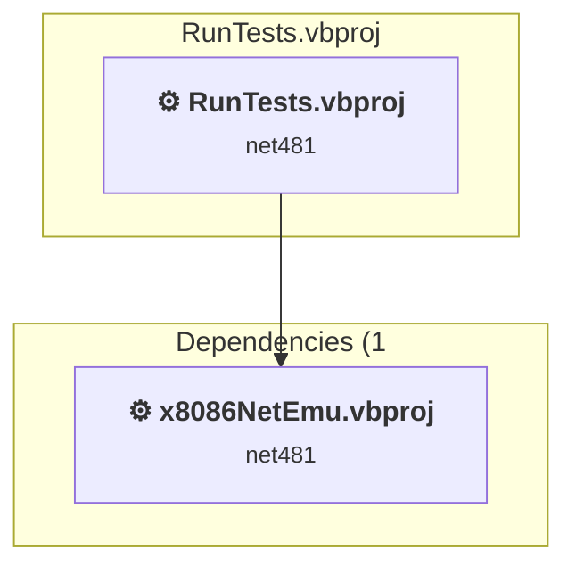

### API Compatibility

| Category | Count | Impact |
| :--- | :---: | :--- |
| 🔴 Binary Incompatible | 3 | High - Require code changes |
| 🟡 Source Incompatible | 0 | Medium - Needs re-compilation and potential conflicting API error fixing |
| 🔵 Behavioral change | 0 | Low - Behavioral changes that may require testing at runtime |
| ✅ Compatible | 292 |  |
| ***Total APIs Analyzed*** | ***295*** |  |

### RunTests2\RunTests2.csproj

#### Project Info

- **Current Target Framework:** net481
- **Proposed Target Framework:** net10.0
- **SDK-style**: True
- **Project Kind:** DotNetCoreApp
- **Dependencies**: 1
- **Dependants**: 0
- **Number of Files**: 3
- **Number of Files with Incidents**: 1
- **Lines of Code**: 261
- **Estimated LOC to modify**: 0+ (at least 0.0% of the project)

#### Dependency Graph

Legend:
📦 SDK-style project
⚙️ Classic project

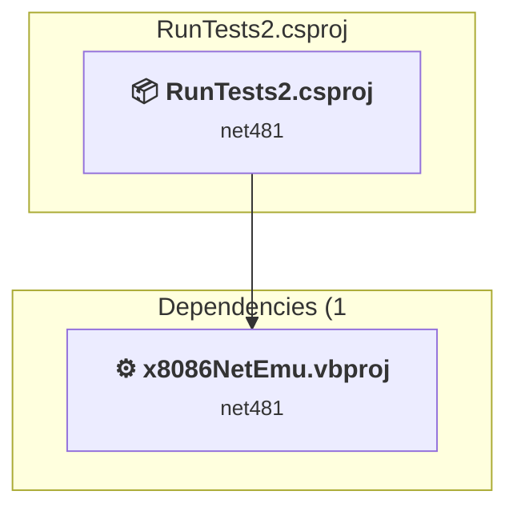

### API Compatibility

| Category | Count | Impact |
| :--- | :---: | :--- |
| 🔴 Binary Incompatible | 0 | High - Require code changes |
| 🟡 Source Incompatible | 0 | Medium - Needs re-compilation and potential conflicting API error fixing |
| 🔵 Behavioral change | 0 | Low - Behavioral changes that may require testing at runtime |
| ✅ Compatible | 367 |  |
| ***Total APIs Analyzed*** | ***367*** |  |

### x8086NetEmu\x8086NetEmu.vbproj

#### Project Info

- **Current Target Framework:** net481
- **Proposed Target Framework:** net10.0
- **SDK-style**: False
- **Project Kind:** ClassicClassLibrary
- **Dependencies**: 0
- **Dependants**: 6
- **Number of Files**: 57
- **Number of Files with Incidents**: 6
- **Lines of Code**: 17053
- **Estimated LOC to modify**: 15+ (at least 0.1% of the project)

#### Dependency Graph

Legend:
📦 SDK-style project
⚙️ Classic project

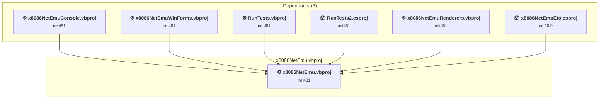

### API Compatibility

| Category | Count | Impact |
| :--- | :---: | :--- |
| 🔴 Binary Incompatible | 6 | High - Require code changes |
| 🟡 Source Incompatible | 3 | Medium - Needs re-compilation and potential conflicting API error fixing |
| 🔵 Behavioral change | 6 | Low - Behavioral changes that may require testing at runtime |
| ✅ Compatible | 10507 |  |
| ***Total APIs Analyzed*** | ***10522*** |  |

#### Project Technologies and Features

| Technology | Issues | Percentage | Migration Path |
| :--- | :---: | :---: | :--- |
| System Management (WMI) | 3 | 20.0% | Windows Management Instrumentation (WMI) APIs for system administration and monitoring that are available via NuGet package System.Management. These APIs provide access to Windows system information but are Windows-only; consider cross-platform alternatives for new code. |

### x8086NetEmuConsole\x8086NetEmuConsole.vbproj

#### Project Info

- **Current Target Framework:** net481
- **Proposed Target Framework:** net10.0
- **SDK-style**: False
- **Project Kind:** ClassicDotNetApp
- **Dependencies**: 2
- **Dependants**: 0
- **Number of Files**: 6
- **Number of Files with Incidents**: 1
- **Lines of Code**: 260
- **Estimated LOC to modify**: 0+ (at least 0.0% of the project)

#### Dependency Graph

Legend:
📦 SDK-style project
⚙️ Classic project

### API Compatibility

| Category | Count | Impact |
| :--- | :---: | :--- |
| 🔴 Binary Incompatible | 0 | High - Require code changes |
| 🟡 Source Incompatible | 0 | Medium - Needs re-compilation and potential conflicting API error fixing |
| 🔵 Behavioral change | 0 | Low - Behavioral changes that may require testing at runtime |
| ✅ Compatible | 92 |  |
| ***Total APIs Analyzed*** | ***92*** |  |

### x8086NetEmuRenderers\x8086NetEmuRenderers.vbproj

#### Project Info

- **Current Target Framework:** net481
- **Proposed Target Framework:** net10.0-windows
- **SDK-style**: False
- **Project Kind:** ClassicWinForms
- **Dependencies**: 1
- **Dependants**: 2
- **Number of Files**: 19
- **Number of Files with Incidents**: 11
- **Lines of Code**: 2541
- **Estimated LOC to modify**: 809+ (at least 31.8% of the project)

#### Dependency Graph

Legend:
📦 SDK-style project
⚙️ Classic project

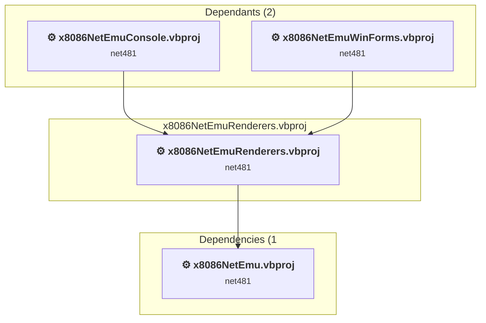

### API Compatibility

| Category | Count | Impact |
| :--- | :---: | :--- |
| 🔴 Binary Incompatible | 361 | High - Require code changes |
| 🟡 Source Incompatible | 448 | Medium - Needs re-compilation and potential conflicting API error fixing |
| 🔵 Behavioral change | 0 | Low - Behavioral changes that may require testing at runtime |
| ✅ Compatible | 2157 |  |
| ***Total APIs Analyzed*** | ***2966*** |  |

#### Project Technologies and Features

| Technology | Issues | Percentage | Migration Path |
| :--- | :---: | :---: | :--- |
| Windows Forms | 361 | 44.6% | Windows Forms APIs for building Windows desktop applications with traditional Forms-based UI that are available in .NET on Windows. Enable Windows Desktop support: Option 1 (Recommended): Target net9.0-windows; Option 2: Add <UseWindowsDesktop>true</UseWindowsDesktop>; Option 3 (Legacy): Use Microsoft.NET.Sdk.WindowsDesktop SDK. |
| GDI+ / System.Drawing | 448 | 55.4% | System.Drawing APIs for 2D graphics, imaging, and printing that are available via NuGet package System.Drawing.Common. Note: Not recommended for server scenarios due to Windows dependencies; consider cross-platform alternatives like SkiaSharp or ImageSharp for new code. |

### x8086NetEmuWinForms\x8086NetEmuWinForms.vbproj

#### Project Info

- **Current Target Framework:** net481
- **Proposed Target Framework:** net10.0-windows
- **SDK-style**: False
- **Project Kind:** ClassicWinForms
- **Dependencies**: 2
- **Dependants**: 0
- **Number of Files**: 30
- **Number of Files with Incidents**: 20
- **Lines of Code**: 5741
- **Estimated LOC to modify**: 5760+ (at least 100.3% of the project)

#### Dependency Graph

Legend:
📦 SDK-style project
⚙️ Classic project

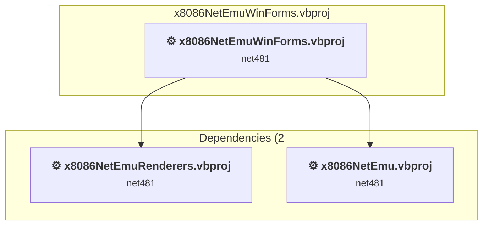

### API Compatibility

| Category | Count | Impact |
| :--- | :---: | :--- |
| 🔴 Binary Incompatible | 5419 | High - Require code changes |
| 🟡 Source Incompatible | 341 | Medium - Needs re-compilation and potential conflicting API error fixing |
| 🔵 Behavioral change | 0 | Low - Behavioral changes that may require testing at runtime |
| ✅ Compatible | 4967 |  |
| ***Total APIs Analyzed*** | ***10727*** |  |

#### Project Technologies and Features

| Technology | Issues | Percentage | Migration Path |
| :--- | :---: | :---: | :--- |
| Legacy Configuration System | 1 | 0.0% | Legacy XML-based configuration system (app.config/web.config) that has been replaced by a more flexible configuration model in .NET Core. The old system was rigid and XML-based. Migrate to Microsoft.Extensions.Configuration with JSON/environment variables; use System.Configuration.ConfigurationManager NuGet package as interim bridge if needed. |
| Code Access Security (CAS) | 1 | 0.0% | Code Access Security (CAS) APIs that were removed in .NET Core/.NET for security and performance reasons. CAS provided fine-grained security policies but proved complex and ineffective. Remove CAS usage; not supported in modern .NET. |
| Windows Forms Legacy Controls | 1 | 0.0% | Legacy Windows Forms controls that have been removed from .NET Core/5+ including StatusBar, DataGrid, ContextMenu, MainMenu, MenuItem, and ToolBar. These controls were replaced by more modern alternatives. Use ToolStrip, MenuStrip, ContextMenuStrip, and DataGridView instead. |
| Windows Forms | 5383 | 93.5% | Windows Forms APIs for building Windows desktop applications with traditional Forms-based UI that are available in .NET on Windows. Enable Windows Desktop support: Option 1 (Recommended): Target net9.0-windows; Option 2: Add <UseWindowsDesktop>true</UseWindowsDesktop>; Option 3 (Legacy): Use Microsoft.NET.Sdk.WindowsDesktop SDK. |
| GDI+ / System.Drawing | 339 | 5.9% | System.Drawing APIs for 2D graphics, imaging, and printing that are available via NuGet package System.Drawing.Common. Note: Not recommended for server scenarios due to Windows dependencies; consider cross-platform alternatives like SkiaSharp or ImageSharp for new code. |

